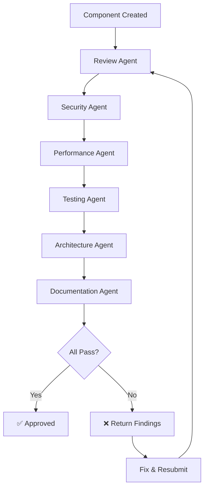

# Frontend Validation Workflow

> End-to-end validation workflow for frontend components and pages.

## Overview

This workflow orchestrates multiple agents to validate frontend code for
accessibility, performance, security, and correctness.

## Workflow Steps



## Step 1: Code Review

**Agent:** Review Agent  
**Focus Areas:**

- Component single responsibility
- Proper prop types and defaults
- Correct hook usage (dependency arrays, rules of hooks)
- Accessibility (ARIA attributes, keyboard navigation, semantic HTML)
- Responsive design implementation

**Blocking Criteria:**

- Missing unique identifiers on repeated elements in lists
- Direct DOM manipulation bypassing the framework's rendering
- Inline styles used for structural layout
- Missing error boundaries for async content

## Step 2: Security Scan

**Agent:** Security Agent  
**Focus Areas:**

| Check                   | Expected                                       | Severity if Missing |
| ----------------------- | ---------------------------------------------- | ------------------- |
| XSS prevention          | No unsanitized user input rendered as raw HTML | Critical            |
| User input sanitization | All form inputs validated client-side          | High                |
| Sensitive data exposure | No tokens/secrets in client bundle             | Critical            |
| CSRF protection         | Tokens in state-changing requests              | High                |
| Content Security Policy | No inline scripts, strict CSP                  | Medium              |
| Third-party scripts     | Subresource integrity (SRI) hashes             | Medium              |
| Local storage           | No sensitive data in localStorage              | High                |
| URL handling            | No `javascript:` URLs, validate external links | High                |

**Blocking Criteria:**

- Unsanitized user input rendered as raw HTML
- API keys or secrets in client code
- Sensitive data in browser storage
- Open redirect vulnerabilities

## Step 3: Performance Validation

**Agent:** Performance Agent  
**Focus Areas:**

### Bundle Size

| Metric            | Target                 | Max                 |
| ----------------- | ---------------------- | ------------------- |
| Component JS size | < 20KB                 | < 50KB              |
| Total page JS     | < 150KB gzipped        | < 300KB             |
| CSS per component | < 5KB                  | < 15KB              |
| Images            | WebP/AVIF, lazy loaded | No unoptimized PNGs |

### Runtime Performance

| Metric                   | Target | Max    |
| ------------------------ | ------ | ------ |
| First Contentful Paint   | < 1.5s | < 2.5s |
| Time to Interactive      | < 2s   | < 4s   |
| Cumulative Layout Shift  | < 0.1  | < 0.25 |
| Largest Contentful Paint | < 2.5s | < 4s   |

### Anti-Patterns to Detect

- Rendering large lists without virtualization (> 100 items)
- Importing entire libraries when only small utilities are needed
- Missing image dimensions (causes layout shift)
- Blocking the main/UI thread with heavy computation
- Triggering data fetches in the render cycle without loading states
- Unnecessary component re-renders due to unstable references

## Step 4: Test Generation

**Agent:** Testing Agent  
**Required Test Categories:**

**Rendering**

- Renders all key UI elements with default props
- Shows loading state during async operations

**Interaction**

- Inputs update correctly on user input
- Form submission calls the handler with expected values
- Submit is disabled when the form is invalid

**Validation**

- Shows field-level errors for invalid input
- Clears errors when input becomes valid

**Error Handling**

- Displays API/server error messages
- Re-enables the form after a submission failure

**Accessibility**

- All inputs have associated labels
- Interactive elements have accessible names (aria-label or visible label)
- Errors are announced to assistive technologies
- All functionality is reachable by keyboard alone
- Focus moves to the first error field on validation failure

**Edge Cases**

- Handles paste events in inputs
- Prevents double submission
- Handles network timeout gracefully

### Testing Approach

- Use the project's component testing library to render and interact with components
- Use accessibility audit tools to catch WCAG violations automatically
- Test through the user interface, not internal implementation details

## Step 5: Architecture Check

**Agent:** Architecture Agent  
**Validates:**

```
src/
├── components/ui/        → Generic, reusable (Button, Input, Modal)
├── components/features/  → Feature-specific (LoginForm, OrderTable)
├── layouts/              → Page layout wrappers
└── pages/                → Route-level entry components
```

**Rules:**

- UI components have no business logic
- Feature components compose UI components
- State management at appropriate level (local vs. global)
- No prop/data drilling more than 2–3 levels (use context or composition)
- Shared state in dedicated stores/contexts
- API calls in dedicated data-fetching hooks or services, not in components

## Step 6: Documentation Check

**Agent:** Documentation Agent  
**Validates:**

- Component has inline documentation with a usage example
- Props/inputs are documented with types and descriptions
- README updated if a new pattern is introduced

## Acceptance Criteria

All agents must pass:

- [ ] Review Agent: No critical findings, accessibility compliant
- [ ] Security Agent: No XSS vectors, no exposed secrets
- [ ] Performance Agent: Bundle < budget, no re-render issues
- [ ] Testing Agent: Coverage ≥ 80%, a11y tests pass
- [ ] Architecture Agent: Proper component hierarchy
- [ ] Documentation Agent: Props documented, examples provided

## Failure Handling

1. **Accessibility violation** → Always blocks (legal requirement)
2. **XSS vulnerability** → Always blocks
3. **Performance budget exceeded** → Blocks if > 2x target
4. **Missing tests** → Blocks if coverage < 80%
5. **Architecture violation** → Blocks for new patterns, warns for existing
