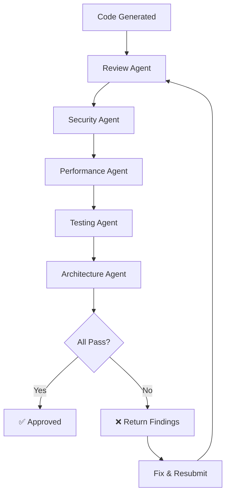

# Login API Validation Workflow

> End-to-end validation workflow for login/authentication API endpoints.

## Overview

This workflow orchestrates multiple agents to validate a Login API implementation
from every angle: security, correctness, performance, and test coverage.

## Workflow Steps

## Step 1: Code Review

**Agent:** Review Agent  
**Focus Areas:**

- Input validation for email/username and password
- Proper error handling for invalid credentials
- Response format consistency
- No information leakage in error messages

**Blocking Criteria:**

- Generic error messages (don't reveal if user exists)
- Missing input validation
- Improper status codes

## Step 2: Security Scan

**Agent:** Security Agent  
**Focus Areas:**

| Check                    | Expected                           | Severity if Missing |
| ------------------------ | ---------------------------------- | ------------------- |
| Password hashing         | bcrypt with cost ≥ 12              | Critical            |
| Rate limiting            | ≤ 5 attempts/min/IP                | Critical            |
| Timing attack prevention | Constant-time comparison           | High                |
| Session management       | Httponly, Secure, SameSite cookies | Critical            |
| Token expiration         | Access: 15min, Refresh: 7d         | High                |
| Account lockout          | Lock after 10 failed attempts      | Medium              |
| CSRF protection          | Token or SameSite cookie           | High                |
| Brute force protection   | Exponential backoff                | High                |

**Blocking Criteria:**

- Plaintext password storage
- No rate limiting
- Token without expiration
- SQL injection in credential check

## Step 3: Performance Validation

**Agent:** Performance Agent  
**Focus Areas:**

- Login response time < 500ms (including hash verification)
- Database query efficiency (indexed email/username lookup)
- Connection pool usage
- No unnecessary data fetching

**Benchmarks:**

| Metric               | Target | Max    |
| -------------------- | ------ | ------ |
| Response time (p95)  | 300ms  | 500ms  |
| DB queries per login | 1-2    | 3      |
| Memory per request   | < 10MB | < 25MB |

## Step 4: Test Generation

**Agent:** Testing Agent  
**Required Test Cases:**

**Happy Path**

- Returns 200 with auth tokens for valid credentials
- Sets an httponly cookie with the refresh token

**Validation**

- Returns 400 when email/username is missing
- Returns 400 when password is missing
- Returns 400 when email format is invalid

**Authentication Failures**

- Returns 401 for a non-existent user
- Returns 401 for a correct user with wrong password
- Returns the same generic error for both scenarios (no user enumeration)

**Rate Limiting**

- Returns 429 after exceeding the attempt limit
- Resets the rate limit counter after a successful login

**Account Lockout**

- Locks the account after repeated failed attempts
- Returns 423 for a locked account

**Security**

- Does not include the password hash in the response
- Logs failed attempts without including the password
- Invalidates old refresh tokens when a new login occurs

**Edge Cases**

- Handles concurrent login attempts correctly
- Trims whitespace from the email/username field
- Handles special characters in passwords

## Step 5: Architecture Check

**Agent:** Architecture Agent  
**Validates:**

- Auth logic in service layer (not controller)
- Token generation abstracted behind interface
- Password hashing via dedicated utility
- Rate limiting as middleware (not in business logic)
- Proper separation: controller → service → repository

## Acceptance Criteria

All agents must pass for the workflow to succeed:

- [ ] Review Agent: No critical findings
- [ ] Security Agent: Risk level ≤ Medium
- [ ] Performance Agent: All metrics within budget
- [ ] Testing Agent: Coverage ≥ 80%, all cases pass
- [ ] Architecture Agent: No layer violations

## Failure Handling

1. **Critical finding** → Block merge, require fix
2. **High finding** → Block merge, request changes
3. **Medium finding** → Allow merge with tracking issue
4. **Low finding** → Note in review, no block
