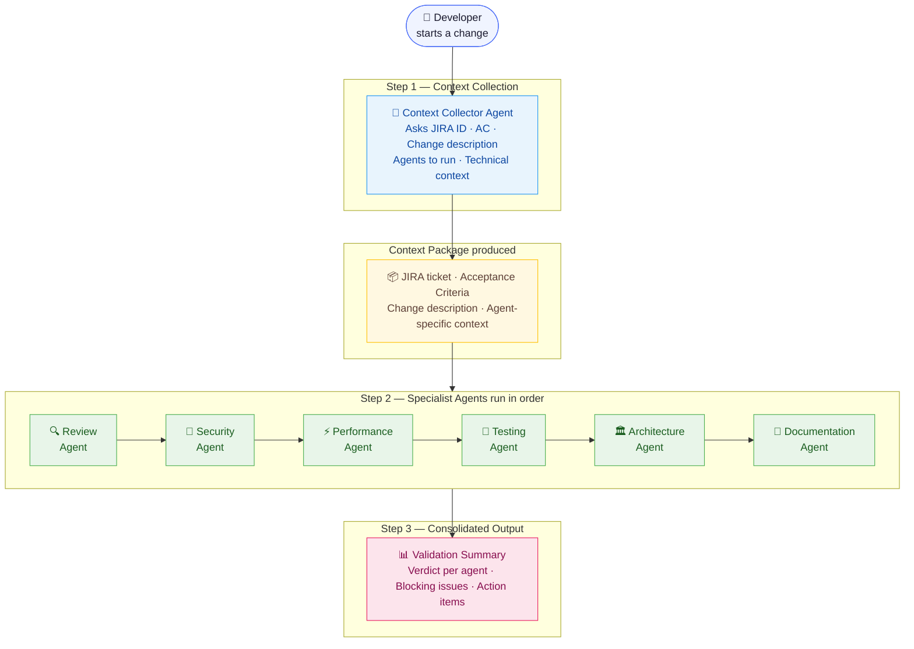

# Agentic Hub

A centralized repository of **AI Rules**, **Agents**, and **Prompt Templates** for AI-powered IDEs — GitHub Copilot, Claude Code, and Cursor.

All rules and agent definitions are platform-agnostic and live in `.ai-agents/`. Each IDE has a thin adapter (`.github/`, `.claude/`, `.cursor/`) that references them.

---

## How the Pipeline Works

Every code change goes through one entry point — the **Context Collector Agent** — which gathers the JIRA ticket details and technical context once. It then hands a structured **Context Package** to each specialist agent. No agent asks questions twice.



### Slash Commands (Claude Code)

| Command      | What it does                                                      |
| ------------ | ----------------------------------------------------------------- |
| `/validate`  | Full pipeline — Context Collector → all selected agents → summary |
| `/review`    | Context Collector → Review Agent only                             |
| `/gen-tests` | Context Collector → Testing Agent only                            |

---

## Agents

All agent definitions live in `.ai-agents/agents/`.

| Agent                      | File                         | Role                                                                                                                                 | When to Run                                     |
| -------------------------- | ---------------------------- | ------------------------------------------------------------------------------------------------------------------------------------ | ----------------------------------------------- |
| 🧭 **Context Collector**   | `context-collector-agent.md` | Gathers JIRA ticket, AC, and technical context once. Produces the Context Package for all other agents.                              | **Always first** — before any other agent       |
| 🔍 **Review Agent**        | `review-agent.md`            | Reviews code for correctness, readability, conventions, and complexity. Validates every Acceptance Criteria item. Flags scope creep. | Every PR and AI-generated code change           |
| 🔐 **Security Agent**      | `security-agent.md`          | Scans for OWASP Top 10 vulnerabilities — injection, XSS, CSRF, broken auth, secrets exposure. Scores risk level.                     | Every code change; new dependencies             |
| 🧪 **Testing Agent**       | `testing-agent.md`           | Maps each AC item to test scenarios, drafts a test plan internally, then generates unit, integration, and E2E tests.                 | After generating or modifying code              |
| ⚡ **Performance Agent**   | `performance-agent.md`       | Detects N+1 queries, O(n²) algorithms, memory leaks, blocking I/O, and missing indexes. Validates against latency targets.           | Hot paths; new DB queries; pre-production       |
| 🏛️ **Architecture Agent**  | `architecture-agent.md`      | Enforces Clean Architecture layer boundaries, detects circular dependencies, validates module structure and API contracts.           | New modules; structural or cross-module changes |
| 📝 **Documentation Agent** | `documentation-agent.md`     | Checks doc comment coverage on all public APIs, generates missing docs, validates OpenAPI specs match implementation.                | New public APIs; after feature additions        |

---

## Rules

All rules live in `.ai-agents/rules/`. They are language and framework agnostic — no TypeScript, React, or Jest specifics.

| Rule File                         | Covers                                                                                                       | Key Standards                                                                                       |
| --------------------------------- | ------------------------------------------------------------------------------------------------------------ | --------------------------------------------------------------------------------------------------- |
| `coding-rules.md`                 | Naming conventions, function design, error handling, module structure, async patterns, comments              | Max 50 lines/function · 500 lines/file · Early returns · Domain error types · No circular deps      |
| `security-rules.md`               | Input validation, authentication, authorization, secrets, injection prevention, HTTP headers, dependencies   | OWASP Top 10 · Parameterized queries · No hardcoded secrets · Allowlist-based sanitization          |
| `testing-rules.md`                | Test structure, naming, AAA pattern, mocking, coverage targets, anti-patterns, integration standards         | 80% unit coverage · 60% integration · Mock only at boundaries · Independent & deterministic tests   |
| `architecture-rules.md`           | Layer boundaries, module layout, dependency injection, request/response patterns, event-driven communication | Presentation → Application → Domain · No layer skipping · Depend on abstractions · No circular deps |
| `api-rules.md`                    | HTTP methods, status codes, versioning, response envelopes, pagination, error format, request validation     | Consistent `{ data }` / `{ error }` envelope · `/v1/` versioning · 400 with field-level errors      |
| `validation-gate.instructions.md` | Shared intake and validation contract for AI instruction entry points                                        | Ask JIRA first · Require Review + Security · Standard quality matrix and final result output        |

---

## Reuse Validation Gate In Another Project

Use `.ai-agents/instructions/validation-gate.instructions.md` when you want one shared instruction file that multiple instruction files can reference.

### Step 1 — Copy The Shared Rule File

Copy this file into the target repository:

```text
.ai-agents/instructions/validation-gate.instructions.md
```

### Step 2 — Paste This Line Into Main Instruction Files

Use this exact line:

```md
Follow `.ai-agents/instructions/validation-gate.instructions.md` for explicit JIRA-first intake, mandatory Review + Security checks on every code change, and the required `AI Agent Quality Matrix` plus `Final Result` output on every validation response.
```

### Step 3 — Add It In The Right Place

Paste that line near the top of each main instruction file, in the section that explains the shared workflow or core rules.

**GitHub Copilot**

File:

```text
.github/copilot-instructions.md
```

Recommended placement: directly under the opening AI workflow section, after the lines that say rules and agents live in `.ai-agents/`.

Example:

```md
## AI Run Agents

All AI-generated code is validated by a pipeline of specialized agents.
Rules for each domain are defined in `.ai-agents/rules/`. Agents are defined in `.ai-agents/agents/`.
Follow `.ai-agents/instructions/validation-gate.instructions.md` for explicit JIRA-first intake, mandatory Review + Security checks on every code change, and the required `AI Agent Quality Matrix` plus `Final Result` output on every validation response.
```

**Claude Code**

File:

```text
CLAUDE.md
```

Recommended placement: inside the `AI Run Agents` section, immediately after the line that says the Context Collector Agent runs first.

Example:

```md
## AI Run Agents

All code changes are validated by a pipeline of specialized agents defined in `.ai-agents/agents/`.
Always start with the **Context Collector Agent**, then invoke the specialist agents in order.
Follow `.ai-agents/instructions/validation-gate.instructions.md` for explicit JIRA-first intake, mandatory Review + Security checks on every code change, and the required `AI Agent Quality Matrix` plus `Final Result` output on every validation response.
```

**Shared Agent Instructions**

File:

```text
AGENTS.md
```

Recommended placement: at the top of the `Agent Pipeline` section, immediately after the summary sentence about the Context Collector Agent.

Example:

```md
## Agent Pipeline

Always start with the **Context Collector Agent**. It gathers JIRA ticket details and technical context once, then passes a Context Package to each specialist agent. Specialist agents do not ask questions — they act on the Context Package.
Follow `.ai-agents/instructions/validation-gate.instructions.md` for explicit JIRA-first intake, mandatory Review + Security checks on every code change, and the required `AI Agent Quality Matrix` plus `Final Result` output on every validation response.
```

### What This Gives You

- One shared file to update when the intake or validation policy changes
- Short main instruction files with only one include line
- Consistent JIRA-first prompting across Copilot, Claude, and shared agent docs
- Consistent final output with `AI Agent Quality Matrix` and `Final Result`

---

## Repository Structure

| Path                    | Purpose                                               |
| ----------------------- | ----------------------------------------------------- |
| `.ai-agents/agents/`    | All 7 agent definitions — central brain               |
| `.ai-agents/rules/`     | 6 canonical, language-agnostic rule files             |
| `.ai-agents/prompts/`   | Reusable prompt templates                             |
| `.ai-agents/workflows/` | End-to-end validation pipelines                       |
| `.claude/commands/`     | Slash commands (`/validate`, `/review`, `/gen-tests`) |
| `.github/`              | GitHub Copilot rules and instructions                 |
| `.cursor/rules/`        | Cursor `.mdc` rule files                              |
| `CLAUDE.md`             | Auto-loaded instructions for Claude Code              |
| `AGENTS.md`             | Shared agent pipeline reference                       |

---

## Getting Started

1. **Clone the repository:**

   ```bash
   git clone https://github.com/codal-georgem/agentic-hub-codal.git
   ```

2. **Open in VS Code** with GitHub Copilot or Claude Code installed.

3. **Start a validation run:**

   ```
   /validate
   ```

   The Context Collector Agent will ask for your JIRA ticket ID and guide you through the rest.

---

## License

MIT
